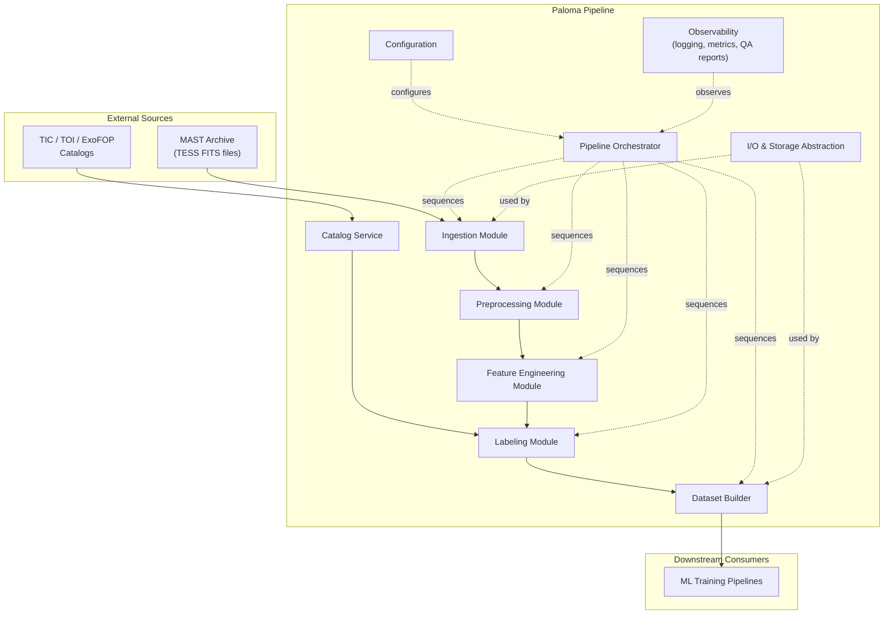
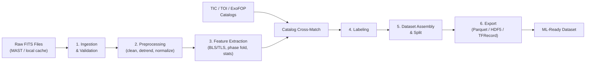
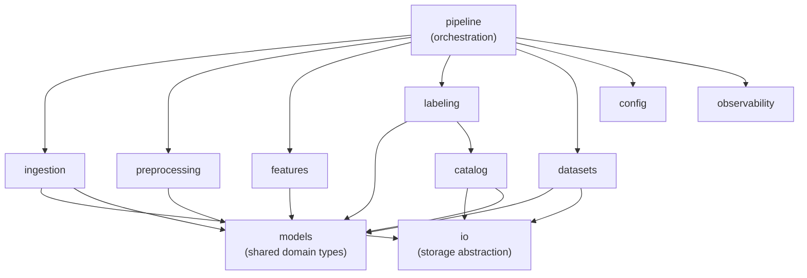
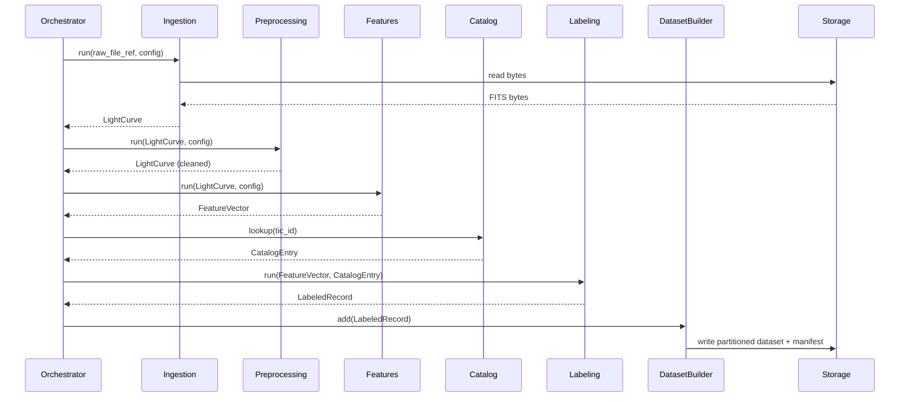
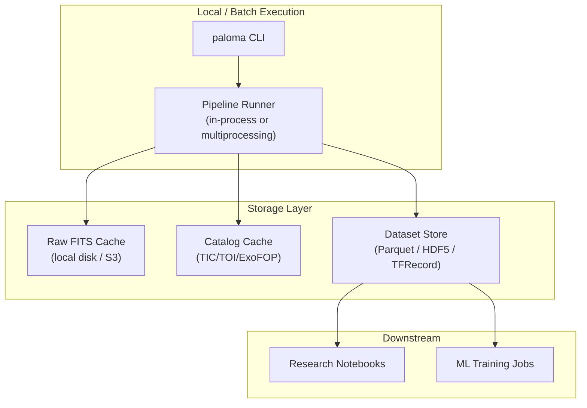
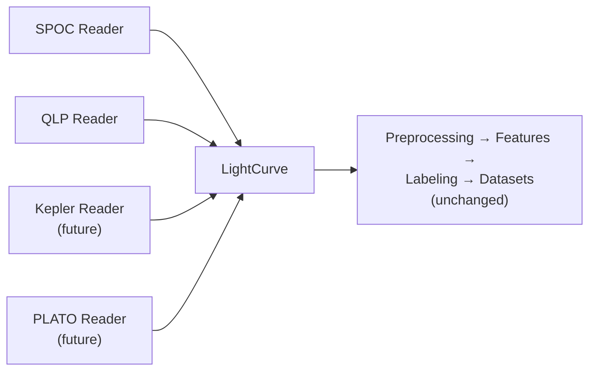

## 1. Project Overview

### 1.1 Purpose

transforms raw astronomical observation data from NASA's **TESS** (Transiting Exoplanet Survey Satellite) mission into structured, versioned, ML-ready datasets used to train and evaluate exoplanet detection models. Paloma is a **data engineering pipeline**, not a modeling library: its job ends where a clean, labeled, reproducible dataset begins, and it exposes that dataset through a stable interface that downstream ML code can consume without needing to understand FITS files, instrument quirks, or catalog cross-matching.

### 1.2 Scope

In scope:

- Ingesting TESS light curve products (SPOC, QLP) and associated metadata.
- Validating and normalizing raw observation data.
- Cleaning, detrending, and preparing time-series data (light curves).
- Extracting features relevant to transit detection (e.g., period search, phase folding, statistical descriptors).
- Cross-matching targets against known catalogs (TIC, TOI, confirmed planets, false positives) to produce labels.
- Assembling versioned, ML-ready datasets (train/validation/test splits) in efficient storage formats.
- Providing a stable, documented interface for ML training code to consume Paloma's output.

Out of scope (for the initial architecture, but see [Section 9 — Extension Points](#9-extension-points)):

- Training or serving ML models.
- Real-time/streaming ingestion (TESS data arrives in batches by sector, not as a live stream).
- Building the transit-detection models themselves.

### 1.3 Inputs

- **Light curve files** (`.fits`) — flux time series per target, produced by SPOC or QLP pipelines and distributed via MAST.
- **Target Pixel Files (TPFs)** (`.fits`) — optional, for pixel-level analysis (e.g., centroid vetting), planned as a future extension.
- **Catalogs**:
  - TESS Input Catalog (TIC) — stellar parameters.
  - TESS Objects of Interest (TOI) — candidate/confirmed dispositions used as ML labels.
  - ExoFOP-TESS community vetting metadata.
- **Mission metadata** — sector, camera, CCD, cadence, data-quality flags.

### 1.4 Outputs

- **Structured, ML-ready datasets** in a columnar/array format (Parquet for tabular/feature data, HDF5 or TFRecord for tensor-shaped light curve arrays), partitioned by sector and split (train/val/test).
- **Feature tables** — per-target engineered features (transit depth, period, duration, statistical descriptors).
- **Labels** — per-target disposition (confirmed planet / planet candidate / false positive / unknown), traceable to source catalog and version.
- **Data quality and lineage reports** — per-run manifest describing what was processed, filtered, and why.

### 1.5 Overall Workflow (Summary)

```
Raw TESS FITS files ──▶ Ingestion & Validation ──▶ Preprocessing (clean/detrend/normalize)
   ──▶ Feature Extraction ──▶ Catalog Cross-Match & Labeling ──▶ Dataset Assembly & Export
   ──▶ ML-ready dataset (consumed by external training pipelines)
```

Each arrow above is a **pipeline stage** with a well-defined input/output contract (see [Section 3](#3-pipeline-flow) and [Section 5](#5-interfaces-between-modules)).

---

## 2. High-Level Architecture

Paloma is organized as a **staged, config-driven batch pipeline** built from independently testable modules. Each major responsibility is isolated into its own component so that it can be developed, tested, and replaced independently.

| Component | Responsibility |
|---|---|
| **Ingestion** | Locate, download/read, and parse raw FITS files into an in-memory data model. Validates structural integrity. |
| **Catalog Service** | Loads and indexes TIC/TOI/ExoFOP reference catalogs; provides lookup and cross-match capability. |
| **Preprocessing** | Cleans and conditions light curves: gap handling, outlier rejection, detrending, normalization, quality-flag filtering. |
| **Feature Engineering** | Derives transit-search features (BLS/TLS period search, phase folding, statistical descriptors) from cleaned light curves. |
| **Labeling** | Joins targets with catalog dispositions to produce ground-truth labels. |
| **Dataset Builder** | Assembles processed records into partitioned, versioned, ML-ready dataset artifacts; manages train/val/test splitting. |
| **Pipeline Orchestrator** | Sequences stages into a DAG, manages retries, checkpointing, and parallel execution across targets/sectors. |
| **Configuration** | Central, declarative definition of pipeline behavior (which stages run, with what parameters) per run. |
| **I/O & Storage Abstraction** | Uniform interface over local filesystem / object storage (S3, etc.) so stages never talk to storage directly. |
| **Observability** | Structured logging, per-stage metrics, and data-quality reporting across the pipeline. |

### 2.1 Component Diagram



---

## 3. Pipeline Flow

The pipeline processes data as a sequence of **stages**, where each stage consumes and produces well-defined data structures (not raw files). This decouples "what a stage does" from "where data lives."

### 3.1 End-to-End Flow



### 3.2 Stage Descriptions

1. **Ingestion & Validation** — Reads raw FITS files, parses headers and flux/time arrays into a canonical `LightCurve` object, validates structural integrity (expected columns, non-empty flux array, valid WCS/header fields), and tags each record with mission metadata (TIC ID, sector, camera, CCD).
2. **Preprocessing** — Applies data-quality flag filtering (removing flagged cadences), gap detection, outlier rejection (sigma clipping), detrending (e.g., Savitzky-Golay, spline, or median filtering to remove stellar variability/instrumental systematics), and normalization (median-normalized flux).
3. **Feature Extraction** — Runs transit-search algorithms (Box Least Squares / Transit Least Squares) to identify candidate periods, computes phase-folded light curves, and derives statistical descriptors (depth, duration, SNR, odd/even mismatch, skewness/kurtosis).
4. **Catalog Cross-Match & Labeling** — Cross-matches each target (by TIC ID) against TOI/ExoFOP dispositions to assign a ground-truth label (`confirmed_planet`, `planet_candidate`, `false_positive`, `unknown`).
5. **Dataset Assembly** — Aggregates per-target feature vectors + labels + provenance into a unified dataset, applies deterministic train/validation/test splitting (e.g., by TIC ID hash to avoid leakage), and versions the output.
6. **Export** — Serializes the final dataset into ML-friendly formats (Parquet for feature tables, HDF5/TFRecord for raw/folded light curve arrays), alongside a manifest describing dataset version, source sectors, and applied configuration.

---

## 4. Module Breakdown

Proposed Python package layout:

```
paloma/
├── ingestion/          # Reads raw FITS files → canonical LightCurve objects
│   ├── readers/        #   Format-specific readers (SPOC, QLP, future missions)
│   └── validators/     #   Structural/quality validation
├── catalog/            # Loads & indexes TIC/TOI/ExoFOP reference data
│   ├── sources/        #   Catalog-specific fetch/parse adapters
│   └── crossmatch.py   #   TIC-ID based lookup and joins
├── preprocessing/       # Cleans and conditions light curves
│   ├── filtering.py    #   Quality-flag & gap filtering
│   ├── outliers.py     #   Sigma clipping / outlier rejection
│   ├── detrending.py   #   Stellar-variability & systematics removal
│   └── normalization.py
├── features/            # Feature engineering
│   ├── period_search.py #   BLS / TLS implementations
│   ├── folding.py       #   Phase-folding utilities
│   └── statistics.py    #   Statistical descriptors
├── labeling/             # Joins features with catalog dispositions
│   └── labeler.py
├── datasets/             # Final dataset assembly & export
│   ├── builder.py        #   Aggregation, splitting, versioning
│   └── writers/           #   Format-specific writers (Parquet, HDF5, TFRecord)
├── pipeline/              # Orchestration
│   ├── stages.py          #   Stage interface & registry
│   ├── dag.py             #   DAG definition / execution
│   └── runner.py          #   Local/distributed execution entrypoint
├── io/                    # Storage abstraction (local FS, S3, etc.)
│   └── storage.py
├── config/                # Configuration schema & loading (YAML-based)
│   └── schema.py
├── models/                # Shared in-memory data model (LightCurve, Catalog entry, FeatureVector, LabeledRecord)
│   └── domain.py
├── observability/          # Logging, metrics, data-quality reporting
│   └── logging.py
└── cli/                    # Command-line entrypoints (run pipeline, run single stage)
    └── main.py
```

### 4.1 Module Responsibilities & Interactions

- **`ingestion`** depends only on `io` (to read bytes) and `models` (to produce `LightCurve`). It has no knowledge of preprocessing or features.
- **`catalog`** is independent of `ingestion`; it depends only on `io` and `models`. It is invoked by `labeling`, not by `preprocessing` or `features`.
- **`preprocessing`** consumes and produces `LightCurve` objects — it never touches raw FITS or storage directly.
- **`features`** consumes cleaned `LightCurve` objects and produces `FeatureVector` objects; it has no knowledge of labels or catalogs.
- **`labeling`** consumes `FeatureVector` + `catalog` lookups, producing `LabeledRecord` objects. This is the *only* module allowed to combine feature data with catalog data.
- **`datasets`** consumes `LabeledRecord` collections and is solely responsible for splitting, versioning, and serialization — it has no domain logic about astronomy.
- **`pipeline`** knows about all stages *by interface only* (see [Section 5](#5-interfaces-between-modules)) and sequences them; it contains no domain logic itself.
- **`config`** is read by `pipeline` and passed down to each stage as typed parameters — no module reads configuration files directly except `pipeline`.

This one-directional dependency structure (ingestion → preprocessing → features → labeling → datasets, with catalog and io as shared services) keeps the module graph acyclic and each module unit-testable in isolation.



---

## 5. Interfaces Between Modules

To keep modules replaceable and testable, every pipeline stage implements a common **Stage** interface, and data crosses module boundaries only as instances of a small set of shared domain types — never as raw file paths or dicts.

### 5.1 Shared Domain Types (`paloma.models`)

- **`LightCurve`** — canonical in-memory representation of a target's time series: `tic_id`, `sector`, `time[]`, `flux[]`, `flux_err[]`, `quality_flags[]`, `metadata{}`.
- **`CatalogEntry`** — a stellar/disposition record: `tic_id`, `stellar_params{}`, `disposition`, `source_catalog`, `catalog_version`.
- **`FeatureVector`** — derived features for a target: `tic_id`, `sector`, `features{}` (period, depth, duration, SNR, ...), `folded_light_curve` (optional).
- **`LabeledRecord`** — a `FeatureVector` joined with a label: `tic_id`, `features{}`, `label`, `label_source`, `provenance{}`.

### 5.2 Stage Interface (`paloma.pipeline.stages`)

Every processing module exposes at least one class implementing:

```python
class Stage(Protocol):
    name: str

    def run(self, inputs: Any, config: StageConfig) -> Any: ...
```

Concrete contracts per module:

| Stage | Input type | Output type |
|---|---|---|
| Ingestion Reader | raw file bytes / path | `LightCurve` |
| Preprocessing Transform | `LightCurve` | `LightCurve` |
| Feature Extractor | `LightCurve` | `FeatureVector` |
| Labeler | `FeatureVector`, `CatalogEntry` | `LabeledRecord` |
| Dataset Writer | `Iterable[LabeledRecord]` | dataset artifact (file/manifest) |

Because every **Transform** (preprocessing step) has the signature `LightCurve -> LightCurve`, transforms are composable and reorderable via configuration — new steps can be inserted into the chain without changing the pipeline orchestrator or any other module.

### 5.3 Boundary Rules

- Modules communicate **only** through the domain types above and the `Stage` interface — never through shared mutable global state.
- Only `ingestion` and `datasets` are permitted to perform file I/O, and only through the `io` abstraction — no other module opens a file or a network connection directly.
- Only `labeling` is permitted to depend on `catalog`.
- `pipeline` depends on every stage's *interface*, never on a concrete implementation class — stages are registered and resolved by name via configuration (a simple registry/factory pattern), which is what allows swapping implementations without touching orchestration code.

---

## 6. Data Flow

Data flows through the system as **typed, immutable-by-convention records**, transformed stage by stage. No stage mutates its input in place; each returns a new object, which makes the pipeline safe to parallelize per-target and simple to reason about (a failure in one stage cannot corrupt data already produced by an earlier stage for other targets).



### 6.1 Granularity of Processing

Ingestion through labeling operate **per target** (one light curve at a time), which enables trivial parallelization (multiprocessing, or distributed execution via Dask/Ray if scale requires it later). Dataset assembly operates **per batch/sector**, since splitting and versioning require visibility across many targets at once. This distinction (per-target vs. per-batch stages) is an explicit property of each stage's interface and is respected by the orchestrator when scheduling work.

---

## 7. Architectural Decisions

| Decision | Rationale |
|---|---|
| **Staged pipeline with a shared in-memory domain model**, rather than passing file paths between steps | Decouples processing logic from storage/format concerns. A `LightCurve` object is identical whether it originated from a SPOC FITS file, a QLP FITS file, or (in the future) a Kepler file — this is what makes new data sources cheap to add. |
| **Config-driven stage composition** (YAML defines which transforms run, in what order, with what parameters) | TESS detrending/feature methods are an active research area; researchers need to swap or reorder steps without code changes, and every dataset run must be exactly reproducible from its config file. |
| **Explicit `Stage` interface + registry**, rather than direct function calls between modules | Enforces the Open/Closed Principle: new implementations (a new detrending method, a new period-search algorithm) are added by writing a new class and registering it — no existing code is modified. |
| **`labeling` is the only module allowed to touch both `features` and `catalog`** | Prevents catalog cross-matching logic from leaking into feature engineering or preprocessing, which would otherwise create hidden coupling and make those modules harder to test in isolation (they'd require catalog fixtures to test unrelated logic). |
| **Per-target processing through labeling; per-batch processing for dataset assembly** | Reflects the true data dependency: cleaning and features are computed independently per star, but splitting/versioning requires a global view to avoid target leakage across train/val/test. |
| **Columnar/array storage formats (Parquet, HDF5/TFRecord) for output**, rather than re-exporting FITS | ML frameworks consume tensors and tabular features efficiently in these formats; FITS is an instrument-data interchange format, not an ML-training format. |
| **Storage abstraction (`io`) instead of direct filesystem/S3 calls in domain modules** | Keeps ingestion/export logic identical whether data lives on local disk (development) or object storage (production/scale), and makes those modules testable with an in-memory fake. |
| **Deterministic, hash-based train/val/test splitting by TIC ID** | Avoids the same star (or a near-duplicate of it across sectors) leaking across splits, a well-known failure mode in TESS/Kepler ML literature that silently inflates validation performance. |
| **Pipeline orchestrator kept intentionally simple (a DAG runner over `Stage` objects)** rather than adopting a heavyweight workflow engine (Airflow/Prefect) from day one | At current scale, a custom lightweight runner is simpler to reason about, test, and run locally; the `Stage` interface is deliberately compatible with being wrapped by Airflow/Prefect tasks later without changing any stage's internals (see [Extension Points](#9-extension-points)). |

---

## 8. Dependency Diagram

### 8.1 Module Dependency Graph

(See [Section 4.1](#41-module-responsibilities--interactions) for the annotated version with responsibilities.)

### 8.2 Runtime Deployment View



---

## 9. Extension Points

The architecture is deliberately designed around three "seams" so that growth does not require rearchitecting:

### 9.1 New Preprocessing Stages

Any new cleaning/detrending technique is added as a new `Transform` implementation (`LightCurve -> LightCurve`) in `paloma.preprocessing`, registered under a name, and enabled via config:

```yaml
preprocessing:
  steps:
    - name: quality_flag_filter
    - name: sigma_clip
      params: { sigma: 5 }
    - name: savgol_detrend
      params: { window_length: 101 }
    - name: new_custom_detrender   # <- added without touching the orchestrator
```

### 9.2 New Data Sources / Future Missions

Because `ingestion` produces the mission-agnostic `LightCurve` type, supporting a new source (a different TESS pipeline product, or an entirely new mission such as Kepler/K2/PLATO) only requires a new `Reader` implementation that maps that source's raw format to `LightCurve`. Every downstream module (preprocessing, features, labeling, datasets) works unmodified.



### 9.3 New ML Models

Paloma's responsibility ends at producing a versioned, labeled dataset. Because the `datasets` module's output format and schema are stable and model-agnostic (feature tables + label + optional folded light curve tensor), any new model architecture — a different CNN, a transformer, a classical gradient-boosted-tree baseline — consumes the same dataset artifact without requiring changes to Paloma. Model-specific preprocessing (e.g., a specific tensor shape) is the responsibility of a thin adapter layer that lives in the ML training repository, not in Paloma.

### 9.4 New Feature Extractors / Period-Search Algorithms

New algorithms (e.g., an alternative to BLS/TLS, or a learned embedding) are added as new `FeatureExtractor` implementations and enabled per-run via config, following the same registry pattern as preprocessing transforms.

### 9.5 Orchestration Scaling

Because stages only depend on the `Stage` interface and typed domain objects (not on how they are invoked), the custom in-process runner can later be replaced by Airflow, Prefect, or a distributed engine (Dask/Ray) by wrapping each `Stage.run()` call in that system's task abstraction — no stage implementation changes.

---

## 10. Non-Functional Considerations

### 10.1 Maintainability

Strict module boundaries (Section 5) and a small set of shared domain types keep the codebase navigable: a contributor fixing a detrending bug only needs to understand `preprocessing` and `models`, not the entire pipeline.

### 10.2 Scalability

Per-target stages (ingestion → labeling) are embarrassingly parallel and can scale from single-process execution (development, small sectors) to multiprocessing or distributed execution (Dask/Ray) without interface changes, since the `Stage` interface makes no assumption about execution context. Dataset assembly is the one stage requiring a global view and is designed as a streaming aggregation (partitioned writes per sector) to avoid requiring all targets in memory at once.

### 10.3 Testability

Every module's interface is a pure function over well-defined types (`LightCurve -> LightCurve`, `LightCurve -> FeatureVector`, etc.), so each can be unit-tested with small synthetic light curves (e.g., a flat light curve, a light curve with an injected synthetic transit, a light curve with data gaps) without any file I/O, network access, or catalog dependency. The `io` abstraction allows storage-dependent code (ingestion, dataset writers) to be tested against an in-memory fake store.

### 10.4 Performance

Preprocessing and feature extraction are vectorized (NumPy/pandas/Astropy) and operate per-target, so wall-clock time scales roughly linearly with target count and parallelizes cleanly. Columnar output formats (Parquet) and chunked array formats (HDF5) are chosen specifically for efficient downstream read performance during ML training (partial reads, memory-mapped access).

### 10.5 Reliability

- Every pipeline stage is designed to be **idempotent** — re-running a stage with the same input and config produces the same output, which allows safe retries.
- **Checkpointing** at stage boundaries (persisting intermediate `LightCurve`/`FeatureVector` artifacts per target) means a pipeline run interrupted partway through does not require reprocessing already-completed targets.
- **Validation gates** at ingestion (structural checks) and dataset assembly (schema checks, label distribution sanity checks) catch malformed data before it silently corrupts a training dataset.
- Every dataset artifact ships with a **manifest** recording the exact configuration, code version, and source sectors used, making every dataset fully reproducible and auditable.

### 10.6 Extensibility

Covered in depth in [Section 9](#9-extension-points); the short version is that the `Stage` interface plus a config-driven registry is the single mechanism that makes preprocessing steps, data sources, feature extractors, and orchestration backends all independently swappable.

---

## Appendix: Glossary

- **FITS** — Flexible Image Transport System, the standard file format for astronomical data.
- **SPOC** — Science Processing Operations Center, NASA's primary TESS data-reduction pipeline.
- **QLP** — Quick Look Pipeline, an alternative/complementary TESS light-curve extraction pipeline (MIT).
- **TIC** — TESS Input Catalog, a catalog of stellar targets observed by TESS.
- **TOI** — TESS Object of Interest, a candidate transit signal flagged for vetting.
- **BLS / TLS** — Box Least Squares / Transit Least Squares, standard algorithms for detecting periodic transit signals in light curves.
- **Light curve** — a time series of a star's brightness (flux) measurements.
