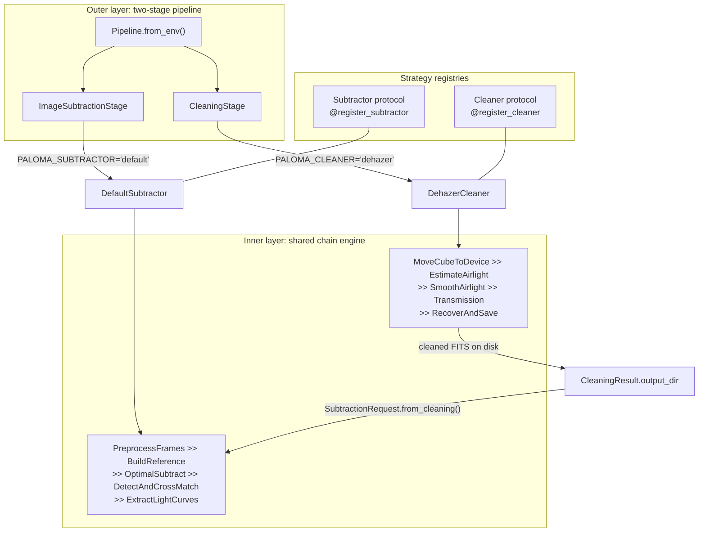

# Paloma — Project Overview

> B.Sc. Computer Science final project.
> This document explains what the project is, what was built, and how it was verified.
> By Yonatan Gabay, yonatang8675@gmail.com.

---

## Table of contents

1. [What this project is](#1-what-this-project-is)
2. [Where the code came from](#2-where-the-code-came-from)
3. [What was done, step by step](#3-what-was-done-step-by-step)
4. [Verification status](#4-verification-status)
5. [Architecture](#5-architecture)
6. [Algorithm 1 — the dehazer](#6-algorithm-1--the-dehazer)
7. [Algorithm 2 — optimal image subtraction](#7-algorithm-2--optimal-image-subtraction)
8. [Repository layout](#8-repository-layout)
9. [Configuration](#9-configuration)
10. [How to run it](#10-how-to-run-it)
11. [Testing strategy](#11-testing-strategy)

---

## 1. What this project is

Paloma is a two-stage processing pipeline for **TESS Full Frame Images** (FFIs). TESS is a NASA space telescope that photographs large patches of sky repeatedly, so that brightness changes over time reveal transiting exoplanets, supernovae, and other variable phenomena.

Two problems stand between a raw FFI and a usable light curve:

1. **Scattered light.** Sunlight and earthshine scatter inside the telescope optics and add a large, smoothly varying glow across the frame. It swamps faint sources and drifts between frames.
2. **Crowding.** TESS pixels are 21 arcseconds wide, so many stars fall in one pixel. Measuring one star directly is unreliable; what you actually want is the *change* relative to a stable reference.

Paloma addresses both, in order:

```text
raw FFIs  ->  Stage 1: Cleaning (dehazer)  ->  cleaned FITS
          ->  Stage 2: Image Subtraction (OIS)
          ->  residual images + source catalog + light curves
```

Stage 1 removes the scattered-light glow. Stage 2 builds a reference frame from the cleaned data, subtracts each frame from it to leave only what changed, then detects sources in those residuals and extracts a light curve for each one.

The engineering contribution of this project is not the two algorithms themselves — they came from existing research code. It is that both were **rewritten from a specification into one tested, configurable, composable pipeline** whose numerical output is verified against the originals.

---

## 2. Where the code came from

| Upstream | What it does | Origin |
|---|---|---|
| [`tess-scatter-removal`](https://github.com/Astro-informatics-cipher-project/tess-scatter-removal) (private) | Scattered-light removal via spatio-temporal patch recurrence | Accompanies the M.Sc. thesis *Removing Scattered Light in TESS Full Frame Images via Spatio-Temporal Patch Recurrence*, Shachar Fridman, Ariel University, 2026 |
| [`image-subtraction`](https://github.com/Astro-informatics-cipher-project/image-subtraction) | Optimal Image Subtraction for TESS FFIs, Python + a C differencing binary | Based on the Oelkers et al. implementation |

Both upstream READMEs are kept next to this file in `docs/` ([`tess-scatter-removal README.md`](tess-scatter-removal%20README.md), [`Image Subtraction Readme.md`](Image%20Subtraction%20Readme.md)) as a record of the original interfaces.

The dehazer treats scattered light exactly like **haze in a photograph**. That is the key insight worth understanding, because the whole algorithm follows from it. The standard atmospheric haze model is

<p align="center"><em>I</em>(<em>x</em>) = <em>L</em>(<em>x</em>) <em>t</em>(<em>x</em>) + <em>A</em> (1 − <em>t</em>(<em>x</em>))</p>

where *I* is what the detector records, *L* is the true scene, *t* ∈ (0,1] is transmission (how much of the true scene survives), and *A* is the *airlight* — the intensity of the scattering veil. Recovering *L* means estimating *A* and *t*, then inverting the equation. Techniques from blind image dehazing therefore transfer to astronomical frames.

---

## 3. What was done, step by step

The work was not a direct port. Each algorithm was locked down with tests, specified from the existing code, then rewritten from that specification. That order is the point: the tests pin what the original actually does, the reverse PRD says what it is supposed to do, and the rewrite has to satisfy both.

The same loop ran twice — first for the dehazer, then for image subtraction — and only then were the two stages composed into one pipeline.

1. **Clone the original.** Start from [`tess-scatter-removal`](https://github.com/Astro-informatics-cipher-project/tess-scatter-removal) (private).
2. **Write tests against it, including a ground-truth test.** Run the original on real TESS FFIs, capture its output, and treat that as the numerical contract. From this point on, a rewrite is allowed to change structure, not pixels.
3. **Write a reverse PRD from the code.** Infer the intended behaviour from the implementation rather than from comments or a missing spec.
4. **Rewrite from the PRD only.** Implement 3D (multi-frame) mode only, keep the tests green, and restructure so the algorithm is readable and configurable. The original 2D (per-frame) path was dropped.
5. **Repeat steps 1–4 for image subtraction**, starting from [`image-subtraction`](https://github.com/Astro-informatics-cipher-project/image-subtraction).
6. **Compose both algorithms into one chainable pipeline.** Each stage is a strategy behind a registry, so the pipeline calls an interface rather than a concrete implementation. New cleaners or subtractors register; they do not get wired in by hand.
7. **Cover the whole pipeline with tests and a `.env` file.** Stage selection, paths, and algorithm knobs all come from environment configuration, and the wiring is tested independently of the expensive science loops.

---

## 4. Verification status

Both rewrites are checked against output captured from the original implementations, on the same **5 real TESS FFIs** (sector s0003-2-1, 2048×2048). Reproduce with `pytest tests`.

```text
55 passed in 271.67s (0:04:31)
```

### Stage 1 — dehazer

`tests/cleaning/test_groundtruth.py` compares every pixel of the cleaned frames to the original dehazer's FITS. Tolerance is `rtol = atol = 1e-9`. At that bound the rewrite is numerically equivalent to the original.

### Stage 2 — image subtraction

`tests/image_subtraction/test_groundtruth.py` asserts the **full stage output** — residuals, source catalog, and light curves — in one run. Fixtures live under `tests/data/image_subtraction/groundtruth/`; details are in [that directory's README](../tests/data/image_subtraction/groundtruth/README.md).

| Artifact | What is compared | Contract |
|---|---|---|
| Residual FITS (5 frames) | Paloma vs the original C-backend residuals | `rtol = 1e-6`, `atol = 1e-2`. Largest observed deviation is `7.8e-3`, which is half an ULP of float32 at the brightest pixel (~`1.4e5`). Residuals are stored as float32, so the two backends agree as closely as the file format permits. |
| `found_sources.csv` (1922 rows) | Paloma vs the original detection / cross-match (`src/core_science.py`, commit `456b2d2`) | Row-for-row numeric match at `rtol = atol = 1e-9` |
| `lightcurves.fits` | Paloma vs the original photometry on those residuals | `TIME` to `1e-9`; `FLUX` / `FLUX_ERR` at `rtol = 1e-4`, `atol = 0.5` (a 3-pixel aperture on residuals that differ by ~`1e-2` counts) |

---

## 5. Architecture

Two layers. Both algorithms use them the same way.

**Outer layer** — the pipeline. Cleaning then image subtraction. Each stage is a plug-in: the pipeline calls an interface, and `.env` chooses which algorithm fills it. Stages pass data through directories, not in-memory arrays.

**Inner layer** — a shared chain engine. Each algorithm is a list of steps joined with `>>`, all writing into one context object.



### The strategy layer

Cleaning and image subtraction are the same plug-in slot, twice. The pipeline never names a concrete algorithm. It asks the registry for whoever `.env` selected.

| | Cleaning | Image subtraction |
|---|---|---|
| Interface | `Cleaner` | `Subtractor` |
| Env key | `PALOMA_CLEANER` | `PALOMA_SUBTRACTOR` |
| Built-in | `"dehazer"` | `"default"` |
| Knobs | `PALOMA_DEHAZE_*` | `PALOMA_SUBTRACTION_*` |

Both interfaces are a name plus one method. Return `None` if nothing usable was produced; that stops the pipeline.

```python
class Cleaner(Protocol):
    name: str
    def clean(self, request: CleaningRequest) -> Optional[CleaningResult]: ...

class Subtractor(Protocol):
    name: str
    def subtract(self, request: SubtractionRequest) -> Optional[SubtractionResult]: ...
```

To add an algorithm: subclass `BaseCleaner` or `BaseSubtractor`, decorate it with `@register_cleaner` or `@register_subtractor`, and point the matching env key at its `name`. Do not edit the pipeline. [`paloma/__init__.py`](../paloma/__init__.py) imports both packages so the built-ins register on import.

The files are [`paloma/core/cleaner.py`](../paloma/core/cleaner.py) and [`paloma/core/subtractor.py`](../paloma/core/subtractor.py).

### The chain engine

[`paloma/core/chain.py`](../paloma/core/chain.py) is shared by both algorithms. A `Stage` has a `name`, an optional `requires` tuple, and an `apply(ctx)` method. `>>` composes stages into a `Chain`, plain callables are wrapped automatically, and `requires` is enforced at runtime against `ctx.run_history`, so an out-of-order chain fails loudly instead of producing garbage.

Each registered strategy builds one chain and runs it against its own context:

| Strategy | Context | Chain |
|---|---|---|
| `DehazerCleaner` | `WorkflowContext` | `MoveCubeToDevice >> EstimateAirlight >> SmoothAirlight >> Transmission >> RecoverAndSave` |
| `DefaultSubtractor` | `SubtractionWorkflowContext` | `PreprocessFrames >> BuildReference >> OptimalSubtract >> DetectAndCrossMatch >> ExtractLightCurves` |

**A trap:** `None` means different things in the two layers. In the outer pipeline, a strategy returning `None` halts everything. In the chain engine, a step returning `None` just means "I mutated the context in place" and execution continues. Both are intentional; the asymmetry is easy to misread.

### The handoff

The two strategies do not share memory. Cleaning writes cleaned FITS; subtraction reads that directory. That keeps peak memory bounded and makes intermediate results inspectable.

`SubtractionRequest.from_cleaning()` in [`paloma/core/types.py`](../paloma/core/types.py) takes `CleaningResult.output_dir` as its input directory and overrides two defaults, because cleaned frames are written as a bare `PrimaryHDU`:

```python
defaults = {
    "apply_data_quality_filter": False,  # cleaned frames have no DQUALITY
    "fits_extension": 0,                 # science data is in HDU 0, not 1
}
```

---

## 6. Algorithm 1 — the dehazer

**Entry point:** `dehaze()` in [`dehazer/runner.py`](../paloma/cleaning/dehazer/runner.py).
**Chain:** `MoveCubeToDevice >> EstimateAirlight >> SmoothAirlight >> Transmission >> RecoverAndSave`.

Scattered light is treated as haze. The same small star-field patch appears many times in a frame, under different amounts of glow. Matching those patches estimates the glow (airlight *A*) and how much of the true scene survives (transmission *t*). No training data — the frames supply their own statistics.

<p align="center"><em>I</em> = <em>L</em> <em>t</em> + <em>A</em>(1 − <em>t</em>)</p>

The chain, in order:

**1. Load.** Read FITS, crop calibration edges, normalize the whole batch to [0, 1] with one shared min/max (not per frame — otherwise later time-smoothing is meaningless). Filename order is the time axis.

**2. Estimate airlight.** Keep structured 9×9 patches, match similar ones, and solve for *A* from each pair (*p*₁, *p*₂) (with mean-centred versions *t*₁, *t*₂). Average the estimates, weighting pairs that differ most in haze.

<p align="center"><em>A</em><sub>12</sub> = ⟨<em>t</em><sub>2</sub> − <em>t</em><sub>1</sub>, <em>p</em><sub>1</sub> ⊙ <em>t</em><sub>2</sub> − <em>p</em><sub>2</sub> ⊙ <em>t</em><sub>1</sub>⟩ / ‖<em>t</em><sub>2</sub> − <em>t</em><sub>1</sub>‖<sup>2</sup></p>

**3. Smooth airlight.** Scattered light changes smoothly in time, so *A*(*t*) is Gaussian-smoothed across frames. Single-frame estimates are noisy; this step is doing real work.

**4. Transmission.** Build a per-pixel map from the haze model, then guided-filter it so edges follow the stars, not the noise. Smooth that map in time too.

<p align="center"><em>t</em> ≈ 1 − <em>I</em> / <em>A</em></p>

**5. Recover.** Invert the model, undo the normalization, write `dehazed__*.fits` in original units.

<p align="center"><em>L</em> = (<em>I</em> − <em>A</em>) / <em>t</em> + <em>A</em></p>

Knobs are `PALOMA_DEHAZE_*`.

---

## 7. Algorithm 2 — optimal image subtraction

**Entry point:** `subtract()` in [`image_subtraction/pipeline.py`](../paloma/image_subtraction/pipeline.py).
**Chain:** `PreprocessFrames >> BuildReference >> OptimalSubtract >> DetectAndCrossMatch >> ExtractLightCurves`.

You cannot subtract two frames directly. The PSF jitters between exposures, so a plain difference rings around every star. **Optimal Image Subtraction** fits a convolution kernel that makes the reference look like the science frame, then subtracts. What remains actually changed.

The chain, in order:

**1. Preprocess.** Optional TESS quality filter, cutout, align every frame onto the first frame's WCS. Output: `01_preprocessed/`.

**2. Build the reference.** Median-combine frames into block masters, then into `03_ref_data/master_final.fits`. Median rejects cosmic rays; the stack is deeper than any single frame. Detect stars on it for the kernel fit.

**3. Subtract.** Remove background, fit a small kernel on those stars, convolve the reference, subtract. A positive residual is extra flux in the science frame. Two passes by default: rebuild the reference and subtract again. Output: `04_residual_img/`. Python and C backends are numerically equivalent; C is faster if `build/a.out` is present.

<p align="center"><em>residual</em> = <em>science</em> − (<em>kernel</em> ∗ <em>reference</em>)</p>

**4. Detect and cross-match.** Find both brightenings and fadings on each residual (`DAOStarFinder` also looks for negative peaks). Drop frames with far too many detections, then match sources across frames into `05_sources/found_sources.csv`.

**5. Light curves.** Aperture photometry on each residual. One FITS per source in `06_lightcurves/`, with `TIME`, `FLUX`, `FLUX_ERR`.

Knobs are `PALOMA_SUBTRACTION_*`.

---

## 8. Repository layout

```text
paloma/
  __main__.py             # python -m paloma  (full pipeline)
  pipeline.py             # Pipeline, CleaningStage, ImageSubtractionStage
  config.py  env.py       # .env loading and typed accessors
  core/
    chain.py              # the >> engine: Stage, Chain, as_stage, timed
    cleaner.py            # Cleaner protocol + registry
    subtractor.py         # Subtractor protocol + registry
    stage.py              # PipelineStage ABC (outer layer)
    types.py              # Cleaning/Subtraction Request + Result dataclasses
    log.py                # stdout progress helpers, warning filters
  cleaning/
    dehazer_cleaner.py    # adapter: Cleaner -> dehaze()
    dehazer/
      runner.py           # dehaze(): batching, GPU resolution, orchestration
      cli.py              # dehaze | simulate | validate
      config.py           # DehazeConfig
      core/               # backend, patches, airlight, guided_filter, recover
      io/                 # fits_io, layout
      workflow/           # context + the 5 chain stages
      evaluation/         # synthetic data + MSE/PSNR/SSIM validation
  image_subtraction/
    pipeline.py           # subtract() + DefaultSubtractor adapter
    cli.py  config.py
    core/                 # preprocess, masters, background, ois, ois_c,
                          # kernel_stars, sources, photometry
    io/layout.py          # RunLayout, the 01..06 output directories
    workflow/             # context + the 5 chain stages
tests/                    # see section 11
docs/                     # this file, plus the two upstream READMEs
.env.example              # the authoritative list of every PALOMA_* key
pyproject.toml
```

Output directories for a subtraction run, created by `RunLayout.create()`:

| Directory | Contents |
|---|---|
| `01_preprocessed/` | Aligned, cut-out frames; plus `rejectedFiles.txt` |
| `02_masters_frames/` | `master_000.fits`, ... — block medians |
| `03_ref_data/` | `master_final.fits`, its star list, `.flux` |
| `04_residual_img/` | `subtracted__*.fits` (float32) |
| `05_sources/` | `found_sources.csv` |
| `06_lightcurves/` | One FITS per source with a `LIGHTCURVE` table |

---

## 9. Configuration

Every tunable lives in `.env`. [`.env.example`](../.env.example) is the authoritative catalog and is kept in sync with `ENV_KEYS` in [`paloma/env.py`](../paloma/env.py) by `tests/test_env.py` — that test fails if you add a key to one and not the other. Start with `cp .env.example .env`.

Coercion rules: an empty value means "use the code default"; booleans accept `true`/`false`/`1`/`0`/`yes`/`no`/`on`/`off`; pairs are `x,y`; integers are parsed with base 0, so `0b110010111101` and `0xFF` both work; relative paths resolve against the repository root.

### Selection

| Key | Default | Meaning |
|---|---|---|
| `PALOMA_CLEANER` | `dehazer` | Which registered cleaner to use |
| `PALOMA_SUBTRACTOR` | `default` | Which registered subtractor to use |
| `PALOMA_INPUT_DIR`, `PALOMA_OUTPUT_DIR` | — | Pipeline I/O roots |
| `PALOMA_CLEANED_DIR`, `PALOMA_SUBTRACTED_DIR` | `{output}/cleaned`, `{output}/subtracted` | Per-stage overrides |

### Dehazer — `PALOMA_DEHAZE_*`

| Key suffix | Default | Effect |
|---|---|---|
| `PATCH_SIZE` | `9` | Patch side length in pixels |
| `VARIANCE_THRESHOLD` | `5e-5` | Minimum patch variance to keep |
| `NN_DIST_THRESHOLD` | `0.3` | Descriptor distance cutoff for pairing |
| `NUM_ITERATIONS` | `10` | Airlight reweighting rounds |
| `SIGMA_TEMPORAL` | `1.5` | Gaussian sigma for temporal smoothing |
| `T_MIN_CLIP` | `0.01` | Transmission floor |
| `GUIDED_FILTER_RADIUS` | `60` | Guided filter window radius |
| `GUIDED_FILTER_EPS` | `0.001` | Guided filter regularization |
| `NUM_FRAMES` | `10` | Maximum frames to load |
| `BATCH_SIZE` | empty | Frames per batch (empty = all at once) |
| `CROP_BOTTOM`, `CROP_SIDES` | `30`, `44` | Calibration-edge crop |
| `MAX_PATCHES` | empty | Cap on patches per frame |
| `FITS_EXTENSION` | `1` | Science HDU index |
| `USE_GPU` | `false` | Opt in to CuPy if a free CUDA device exists |

Changing any of the first eight changes numeric output and will break the `1e-9` ground-truth test. That is intended — the test pins the algorithm.

### Image subtraction — `PALOMA_SUBTRACTION_*`

| Key suffix | Default | Effect |
|---|---|---|
| `KERNEL` | `2` | Kernel half-width; footprint is `(2k+1)^2` |
| `STAMP` | `3` | Fitting stamp half-width |
| `ORDER` | `0` | Spatial polynomial degree of the kernel |
| `NR_STARS` | `500` | Kernel stars to fit against |
| `BLKNUM` | `50` | Frames per block master |
| `NUM_ITERATIONS` | `2` | Subtract/rebuild passes |
| `THRESHOLD_SOURCE_DETECTION` | `50.0` | Detection threshold in sigma |
| `FWHM` | `1.5` | `DAOStarFinder` FWHM in pixels |
| `MATCH_RADIUS` | `3` | Cross-match radius in pixels |
| `APERTURE_RAD` | `3` | Photometry aperture radius |
| `EDGE_CUTOFF` | `3` | Border pixels excluded from detection |
| `SOURCE_FILTER_THRESHOLD` | `1.5` | Frame-rejection sigma on detection counts |
| `CUTOUT_CENTER`, `CUTOUT_SIZE` | `1068,1024`, `2048,2048` | Cutout geometry |
| `CRPIX1` | `1001.0` | Reference `CRPIX1` used when aligning and cutting out |
| `NUM_FRAMES` | empty | Frame cap (empty = every FITS in the input directory) |
| `FITS_EXTENSION` | `1` | Science HDU index (the handoff overrides this to `0`) |
| `APPLY_DATA_QUALITY_FILTER` | `true` in code, `false` in `.env.example` | Reject frames by TESS DQUALITY bits |
| `DATA_QUALITY_MASK` | `0b110010111101` | TESS quality bits to reject |
| `USE_C_BACKEND` | `true` | Prefer `build/a.out`, else fall back to Python |
| `CODE_DIR` | `None` in code, `build/code_dir` in `.env.example` | Scratch directory for the C backend |
| `RANDOM_SEED` | `0` | Seeds kernel-star selection |

---

## 10. How to run it

```bash
python -m venv .venv
source .venv/bin/activate
pip install -e ".[dev]"
cp .env.example .env
```

Python 3.10 or newer. Note that `pyproject.toml` pulls `FITS_tools` straight from GitHub, so the install needs network access.

Full pipeline:

```bash
python -m paloma
python -m paloma --input-dir path/to/fits --output-dir results
```

Or from Python, which is also how you compose the stages yourself:

```python
from paloma import Pipeline
result = Pipeline.from_env().run()
```

```python
from paloma import (
    CleaningStage, CleaningConfig, CleaningRequest,
    ImageSubtractionStage, ImageSubtractionConfig,
)

cleaned = CleaningStage.from_config(CleaningConfig.from_env()).run(
    CleaningRequest(input_dir="...", output_dir="results/cleaned")
)
sub = ImageSubtractionStage.from_config(ImageSubtractionConfig.from_env())
result = sub.run_after_cleaning(cleaned, "results/subtracted")
```

Single stages:

```bash
python -m paloma.cleaning.dehazer dehaze --input-dir ... --output-dir ...
python -m paloma.cleaning.dehazer simulate --clean-fits ... --type cloud
python -m paloma.cleaning.dehazer validate --sim-dir ... --output-dir ...
python -m paloma.image_subtraction subtract --input-dir ... --output-dir ...
```

Optional C backend for OIS:

```bash
gcc oisdifference.c -lcfitsio -lm -o build/a.out
```

`oisdifference.c` is **not** in this repository; get it from the upstream `image-subtraction` repo. It is faster than the Python path but no longer more accurate.

---

## 11. Testing strategy

```bash
pytest tests          # 55 tests, ~4.5 minutes (ground-truth tests dominate)
pytest tests -q --deselect tests/cleaning/test_groundtruth.py \
              --deselect tests/image_subtraction/test_groundtruth.py   # ~1s
```

Three layers, covering both stages the same way.

**Ground-truth.** Pins the science: a live run on 5 real TESS FFIs is compared to fixtures under `tests/data/`, so a refactor cannot silently change pixels, catalogs, or light curves. Missing fixtures skip the test. Image-subtraction `raw/` is a symlink onto the cleaning frames, so the FITS are not stored twice.

| Test | What it checks |
|---|---|
| `tests/cleaning/test_groundtruth.py` | Every pixel of the cleaned FITS (`rtol = atol = 1e-9`) |
| `tests/image_subtraction/test_groundtruth.py` | Residuals, `found_sources.csv`, and light curves |

Tolerances for the subtraction artifacts are in [section 4](#4-verification-status).

**Wiring.** The pipeline is only names and directories — these tests check that stages still plug together, config still loads, and a `None` result still stops the run, without waiting for the science loops. Those loops are mocked.

- `tests/cleaning/test_integration.py`
- `tests/image_subtraction/test_integration.py`
- `tests/test_pipeline.py`
- `tests/test_env.py`

**Unit.** A ground-truth failure tells you *that* something broke, not *where*. These cover one function at a time, on tiny arrays, so a kernel or timestamp bug shows up in seconds.

- `tests/core/test_chain.py` — the `>>` engine
- `tests/image_subtraction/test_ois.py` — kernel fit, including a flux-rescale case whose residual should be ~`1e-13`
- `tests/image_subtraction/test_photometry.py`
- `tests/image_subtraction/test_sources.py`