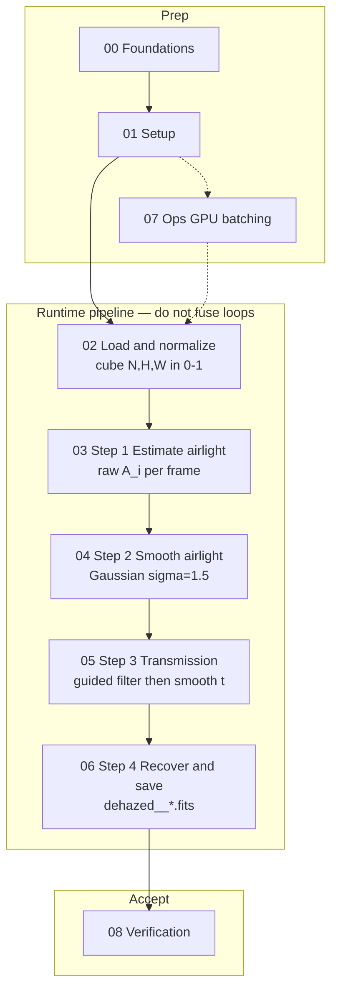
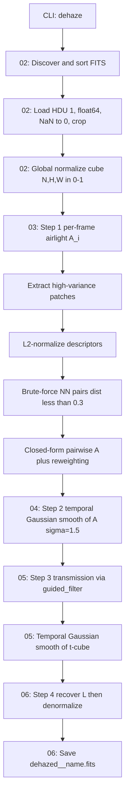

# 3-D Spatio-Temporal Dehazing — Workflow

> **Document type:** Staged reverse-engineered spec / implementation contract.
> **Scope:** The dehazing pipeline (spatio-temporal, i.e. 3-D). The `simulate`
> and `validate` subcommands are referenced only where they provide context or
> are needed to *verify* an implementation.
> **Goal:** Provide enough detail — exact math, constants, ordering, and
> determinism caveats — that a developer can implement the 3-D
> pipeline and obtain **numerically identical** dehazed FITS output
> on the same input files.

TESS Full Frame Images are contaminated by scattered light. This product removes
it by treating the problem as **blind image dehazing** with an Internal Patch
Recurrence prior, extended across a time-ordered sector sequence (global
normalization + temporal smoothing of airlight and transmission).

**Source of truth for ordering:** the code path in
[`tess_dehazing/pipeline/orchestration.py`](../../../paloma/cleaning/dehazer/pipeline/orchestration.py)
(`dehaze` → `build_chain()`, whose stages live in
[`tess_dehazing/workflow/stages.py`](../../../paloma/cleaning/dehazer/workflow/stages.py)). These docs
describe that path; do not fuse the loops below.

---

## Final workflow diagram

Full stage overview, artifact flow, and ordered checklist:
**[diagram.md](diagram.md)**.



Detailed data-flow (within runtime):



---

## Ordered stages

| # | Stage | Role |
|---|---|---|
| 0 | [00-foundations](00-foundations.md) | Purpose, haze model, glossary, goals |
| 1 | [01-setup](01-setup.md) | Stack, package layout, CLI, `DehazeConfig` |
| 2 | [02-load-normalize](02-load-normalize.md) | FITS discovery, crop, global norm |
| 3 | [03-estimate-airlight](03-estimate-airlight.md) | Patches → pairs → pairwise $A$ → reweight (Step 1) |
| 4 | [04-smooth-airlight](04-smooth-airlight.md) | Temporal Gaussian on $A$ (Step 2) |
| 5 | [05-transmission](05-transmission.md) | Guided filter + temporal smooth of $t$ (Step 3) |
| 6 | [06-recover-save](06-recover-save.md) | Recover, denormalize, output contract (Step 4) |
| 7 | [07-ops](07-ops.md) | GPU, batching, determinism caveats |
| 8 | [08-verification](08-verification.md) | Acceptance criteria + golden values |
| — | [appendix](appendix.md) | Thesis map, function index, references |
| — | [diagram](diagram.md) | Final workflow diagrams |

---

## End-to-end algorithm (ordering)

Top-level orchestration: `dehaze` runs `build_chain()` per batch
([tess_dehazing/pipeline/orchestration.py](../../../paloma/cleaning/dehazer/pipeline/orchestration.py),
[workflow/stages.py](../../../paloma/cleaning/dehazer/workflow/stages.py)). The pseudocode below uses
`process_batch(...)` to denote that chain (`MoveCubeToDevice >>
EstimateAirlight >> SmoothAirlight >> Transmission >> RecoverAndSave`); the same
ordering was implemented (as a single method body) in the original pre-refactor
`run_3d`, whose captured outputs the ground-truth test pins against.

```text
dehaze(input_dir, output_dir, cfg):
    makedirs(output_dir)
    use_gpu = resolve_gpu(cfg)                      # 07-ops
    all_files = sorted(glob("*.fits"))[:num_frames] # 02-load-normalize
    for (batch_idx, num_batches, batch_files) in iter_batches(all_files, batch_size):
        cube, metadata = load_fits_directory(input_dir, cfg,
                                             files=batch_files)  # 02 (global norm)
        process_batch(cube, metadata, output_dir, cfg, use_gpu)
    write_output_location_marker(output_dir, input_dir, "dehaze")  # 06-recover-save

process_batch(cube, metadata, output_dir, cfg, use_gpu):
    cube = to_gpu(cube) if use_gpu else cube
    # ---- Step 1: per-frame raw airlight ----
    raw_A = []
    for i in range(N):
        orig, desc = extract_patches(...)   # 03
        pairs      = find_pairs(...)        # 03
        raw_A.append(estimate_airlight(...)) # 03
    # ---- Step 2: temporal smoothing of A ----
    A = gaussian_filter1d(np.array(raw_A), sigma=sigma_temporal, axis=0)  # 04
    # ---- Step 3: per-frame transmission + temporal smoothing ----
    t_cube = zeros_like(cube)
    for i in range(N):
        t_cube[i] = recover_transmission_map(cube[i], A[i], ...)  # 05
    t_cube = gaussian_filter_temporal(t_cube, sigma=sigma_temporal)  # 05
    # ---- Step 4: recover, denormalize, save ----
    for i in range(N):
        if exists(output): continue
        rec    = recover_image(cube[i], A[i], t_cube[i], t_min_clip)  # 06
        result = denormalize(to_cpu(rec), orig_min, orig_max)         # 06
        save_fits(result, "dehazed__" + filename)                    # 06
```

> **Ordering matters.** Airlight for *all* frames is estimated **before** any
> temporal smoothing; transmission maps for *all* frames are computed from the
> **already-smoothed** $A$ series **before** the transmission volume is smoothed;
> recovery uses the **smoothed** $A$ and **smoothed** $t$. Do not fuse these
> loops.
>
> The code computes each transmission map from the **smoothed** $A$ series — a
> refinement over the thesis presentation order (§3.3.2–3.3.3), where
> $T_{\text{raw}}$ is formed from the per-frame $A$ before either is smoothed.
> Reproduce the **code** ordering.

### Chainable stage API

The algorithm is implemented as a **chain of composable stages** on top of a
tiny engine ([tess_dehazing/workflow/engine.py](../../../paloma/cleaning/dehazer/workflow/engine.py)):
`Stage`, `Chain`, and a shared `WorkflowContext`
([context.py](../../../paloma/cleaning/dehazer/workflow/context.py)). Each documented step maps
to one stage ([tess_dehazing/workflow/stages.py](../../../paloma/cleaning/dehazer/workflow/stages.py)),
and stages compose left-to-right with the `>>` operator:

```python
from paloma.cleaning.dehazer.workflow import (
    MoveCubeToDevice, EstimateAirlight, SmoothAirlight, Transmission, RecoverAndSave,
    WorkflowContext,
)

chain = (
    MoveCubeToDevice()
    >> EstimateAirlight()   # Step 1 — 03-estimate-airlight
    >> SmoothAirlight()     # Step 2 — 04-smooth-airlight
    >> Transmission()       # Step 3 — 05-transmission
    >> RecoverAndSave()     # Step 4 — 06-recover-save
)
ctx = WorkflowContext(cfg=cfg, use_gpu=use_gpu, output_dir=out,
                      cube=cube, metadata=metadata)
chain.run(ctx)
```

`build_chain()` returns exactly this chain, and `dehaze` runs it once per
batch. A fluent, method-chaining facade is also available:

```python
from paloma.cleaning.dehazer import DehazePipeline

(DehazePipeline(cfg, use_gpu, batch_label)
    .load(cube, metadata)
    .estimate_airlight().smooth_airlight().transmission()
    .recover_and_save(output_dir))
# equivalently: .load(cube, metadata).run(output_dir)
```

Each stage declares its prerequisites (`Stage.requires`) and the engine's
`WorkflowContext.require` raises if a step runs before the one it depends on —
so the chain enforces the "do not fuse loops" ordering above. Numeric output is
locked down by [tests/test_groundtruth.py](../../tests/test_groundtruth.py),
which diffs the output FITS against the captured `tests/data/groundtruth/expected/`.

### Embedding in a larger pipeline (Strategy API)

This package is meant to slot into a bigger pipeline as one interchangeable
component. [tess_dehazing/strategies/](../../../paloma/cleaning/dehazer/strategies) exposes
the algorithms behind a stable surface so callers never import the internals:

- **Protocol** — `Dehazer` (`label` + `run(input_dir, output_dir, cfg)`).
- **Strategy** — `DehazingStrategy` (`"default"`) subclassing `BaseDehazer`
  (Template Method: `run` → `_run` → collect). New algorithms self-register.
- **Registry / Factory** — `register_strategy`, `create_dehazer(label)`,
  `available_strategies()`.
- **Context** — `DehazingContext` holds the active strategy and delegates.
- **Result** — `DehazeResult` (label, dirs, produced FITS paths).

```python
from paloma.cleaning.dehazer import DehazingContext, DehazeConfig

result = DehazingContext.default().execute(in_dir, out_dir, DehazeConfig())
print(result.num_outputs, "frames ->", result.output_dir)
```

Register a new algorithm without touching anything else (the registry and
factory pick it up automatically):

```python
from paloma.cleaning.dehazer import BaseDehazer, register_strategy

@register_strategy
class MyDehazer(BaseDehazer):
    label = "my-algo"
    def _run(self, input_dir, output_dir, cfg):
        ...
```

Pattern summary: **Strategy + Protocol + Registry/Factory + Context** (selection
and integration) sit on top of the **Chain / Pipeline** (`Stage`/`Chain`) and
**Builder** (`DehazePipeline`) patterns (execution). The strategy layer is
covered by [tests/test_strategy.py](../../tests/test_strategy.py).

---

## Minimal reference recipe

1. Sort `*.fits`, take first `num_frames`.
2. Load HDU 1 → float64 → NaN→0 → crop `[0:H-30, 44:W-44]`.
3. Global-normalize the whole batch to `[0,1]` with one min/max.
4. Per frame: extract `>5e-5`-variance 9×9 patches → mean-subtract + L2-normalize
   → brute-force NN pairs (`dist<0.3`, higher-std first) → closed-form pairwise
   $A$ (keep $0\le A\le1$) → 10-iteration re-weighted average → $A_i$.
5. `gaussian_filter1d` the $A$ series (`sigma=1.5`).
6. Per frame: `t = guided_filter(I, clip(1 - I/max(A_i,1e-6), 0.01, 0.9), 60, 0.001)`.
7. `gaussian_filter1d` the t-cube along axis 0 (`sigma=1.5`).
8. Per frame: `L = clip((I - A_i)/max(t_i, 0.01) + A_i, 0, 1)`.
9. Denormalize with the global min/max; save as `PrimaryHDU` float64 named
   `dehazed__<orig>.fits`.

Start at [00-foundations](00-foundations.md).
