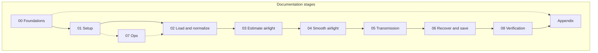
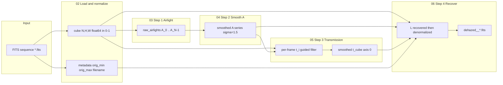
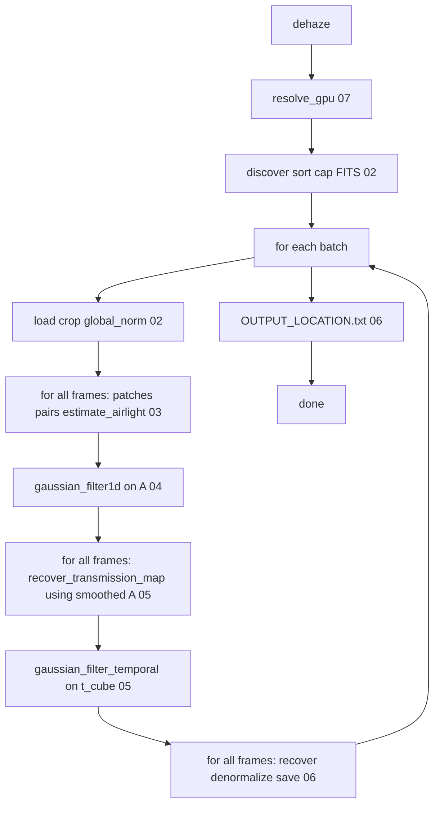

# Final Workflow Diagram

Visual map of the 3-D dehazing workflow. Ordering is load-bearing — see
[`pipeline/orchestration.py`](../../../paloma/cleaning/dehazer/pipeline/orchestration.py). Stage docs:
[index](README.md).

---

## Stage overview

Doc stages and how they relate to the runtime pipeline.

---

## Runtime pipeline (final data flow)

Artifacts produced at each step. Do not fuse the loops marked below.

---

## Ordered checklist (must not fuse)

> Airlight for **all** frames before smoothing $A$. Transmission for **all**
> frames from **smoothed** $A$ before smoothing $t$. Recovery uses **smoothed**
> $A$ and **smoothed** $t$.

---

## Stage ↔ code

| Stage | Primary code |
|---|---|
| 02 | [`io/fits_io.py`](../../../paloma/cleaning/dehazer/io/fits_io.py), [`io/normalize.py`](../../../paloma/cleaning/dehazer/io/normalize.py) |
| 03 | [`core/patches.py`](../../../paloma/cleaning/dehazer/core/patches.py), [`core/airlight.py`](../../../paloma/cleaning/dehazer/core/airlight.py) |
| 04 | [`workflow/stages.py`](../../../paloma/cleaning/dehazer/workflow/stages.py) (`SmoothAirlight`) + `gaussian_filter1d` |
| 05 | [`core/transmission.py`](../../../paloma/cleaning/dehazer/core/transmission.py), [`core/guided_filter.py`](../../../paloma/cleaning/dehazer/core/guided_filter.py), [`core/backend.py`](../../../paloma/cleaning/dehazer/core/backend.py) |
| 06 | [`core/recovery.py`](../../../paloma/cleaning/dehazer/core/recovery.py), [`io/fits_io.py`](../../../paloma/cleaning/dehazer/io/fits_io.py) |
| 07 | [`pipeline/orchestration.py`](../../../paloma/cleaning/dehazer/pipeline/orchestration.py), [`core/backend.py`](../../../paloma/cleaning/dehazer/core/backend.py) |
| 08 | [`evaluation/simulation.py`](../../../paloma/cleaning/dehazer/evaluation/simulation.py) |
